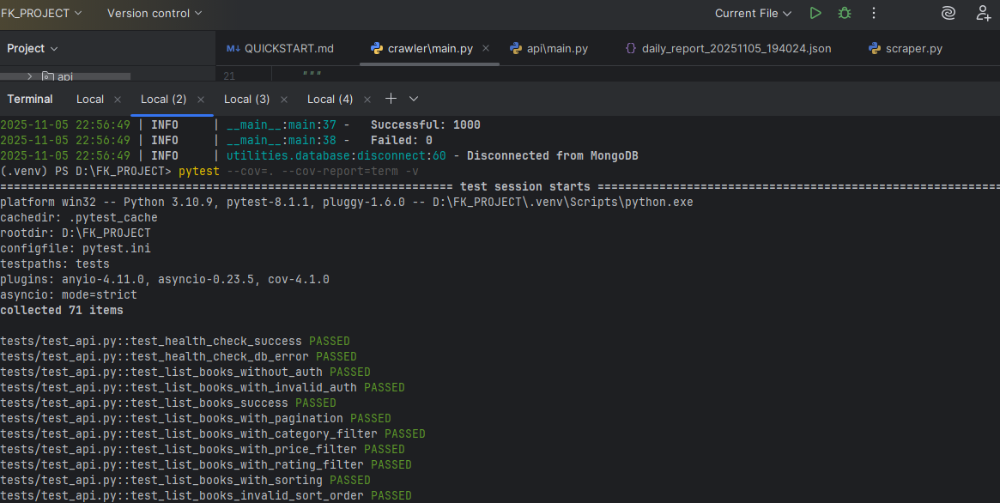
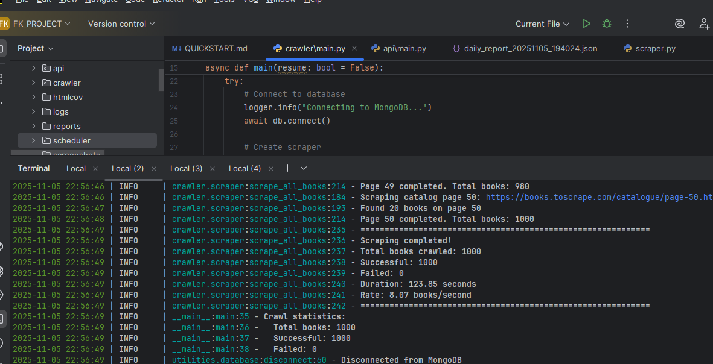
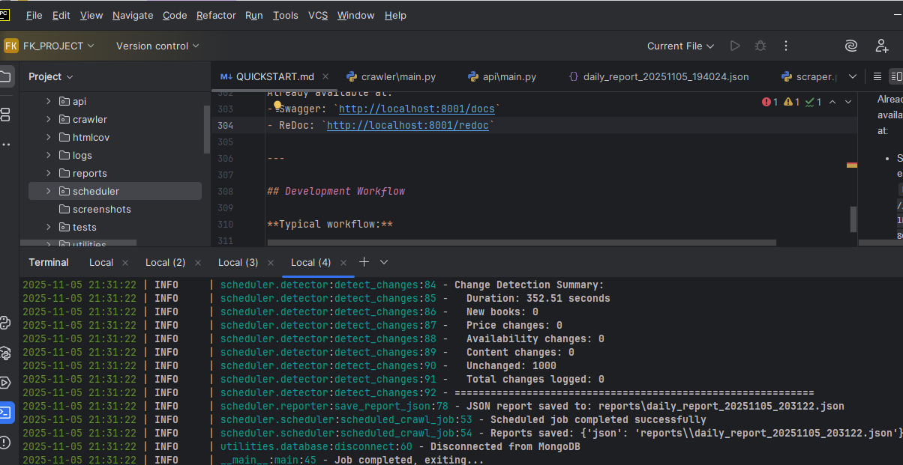
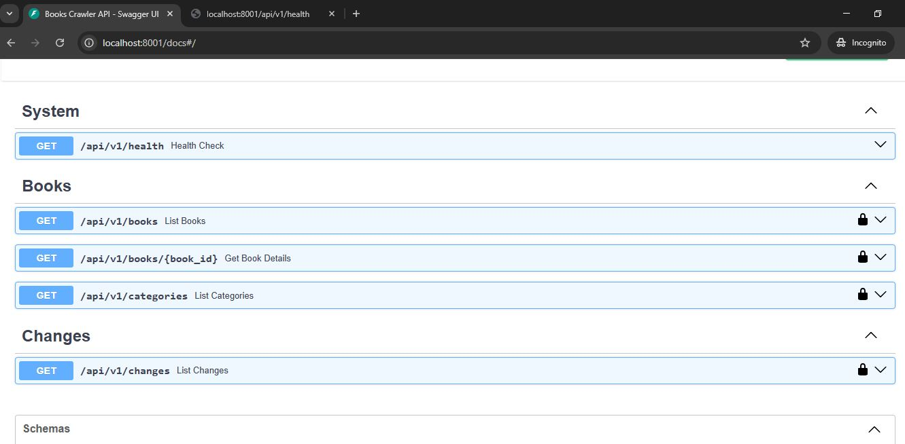
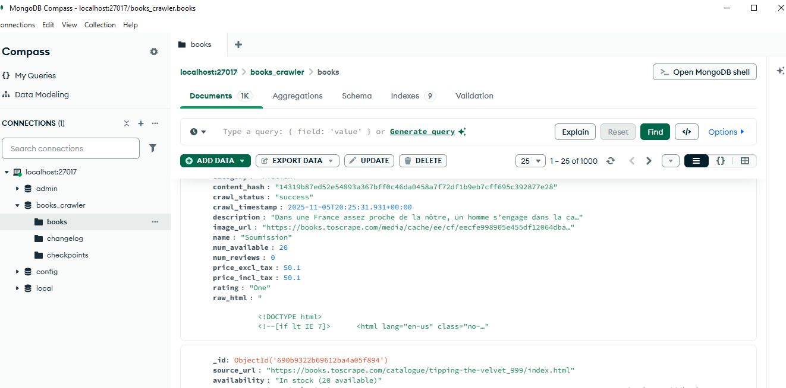

# Books Crawler - Production-Grade Web Scraping System

A scalable, fault-tolerant web crawling system for monitoring book data from e-commerce websites. Built with Python, FastAPI, MongoDB, and async programming.

## Features

###  Core Functionality
- **Async Web Crawler**: High-performance concurrent scraping using `httpx`
- **Change Detection**: Monitors price, availability, and content changes
- **RESTful API**: FastAPI with authentication, rate limiting, and pagination
- **Scheduled Crawls**: Daily automated crawls with APScheduler
- **Fault Tolerance**: Retry logic, checkpoint system for resuming failed crawls
- **Production Ready**: Comprehensive logging, error handling, and test coverage

###  Data Collection
- Book name, description, category
- Prices (including/excluding tax)
- Availability and stock levels
- Review counts and ratings
- Cover images and source URLs
- Raw HTML snapshots for fallback
- Change history tracking

##  Screenshots

### Test Coverage (82%)


### Successful Crawler Execution


### Change Detection


### API Documentation (Swagger UI)


### MongoDB Data


## Project Structure

```
FK_PROJECT/
├── crawler/              # Web crawling module
│   ├── __init__.py
│   ├── main.py          # Crawler entry point
│   ├── parser.py        # HTML parsing logic
│   └── scraper.py       # Async scraper with retry logic
├── scheduler/           # Scheduling and change detection
│   ├── __init__.py
│   ├── main.py          # Scheduler entry point
│   ├── scheduler.py     # APScheduler configuration
│   ├── detector.py      # Change detection logic
│   └── reporter.py      # Report generation
├── api/                 # FastAPI REST API
│   ├── __init__.py
│   ├── main.py          # FastAPI application
│   ├── routes.py        # API endpoints
│   ├── auth.py          # Authentication
│   └── models.py        # API models
├── utilities/           # Shared utilities
│   ├── __init__.py
│   ├── config.py        # Configuration management
│   ├── database.py      # MongoDB operations
│   ├── models.py        # Pydantic data models
│   ├── helpers.py       # Helper functions
│   └── logger.py        # Logging configuration
├── tests/               # Test suite
│   ├── __init__.py
│   ├── test_parser.py
│   └── test_helpers.py
├── logs/                # Log files
├── reports/             # Daily reports (JSON/CSV)
├── requirements.txt     # Python dependencies
├── .env                 # Environment configuration
├── .env.example         # Example configuration
├── .gitignore          # Git ignore patterns
└── README.md           # This file
```

## Prerequisites

- **Python**: 3.10 or higher
- **MongoDB**: 4.4 or higher (local installation or MongoDB Atlas)
- **pip**: Python package manager

## Installation

### 1. Clone or Navigate to Project

```bash
cd D:\FK_PROJECT
```

### 2. Create Virtual Environment

```bash
python -m venv .venv
```

### 3. Activate Virtual Environment

**Windows:**
```bash
.venv\Scripts\activate
```

**Linux/Mac:**
```bash
source .venv/bin/activate
```

### 4. Install Dependencies

```bash
pip install -r requirements.txt
```

### 5. Setup MongoDB

Choose one of these options:

#### Option A: MongoDB Local Installation

1. Download MongoDB Community Edition from [mongodb.com/download-center/community](https://www.mongodb.com/download-center/community)
2. Install and start MongoDB service
3. Default connection: `mongodb://localhost:27017/`

#### Option B: MongoDB Atlas (Cloud - Free Tier)

1. Create account at [mongodb.com/cloud/atlas](https://www.mongodb.com/cloud/atlas)
2. Create a free cluster
3. Get connection string: `mongodb+srv://<username>:<password>@cluster.mongodb.net/`
4. Update `.env` file with connection string

#### Option C: Docker

```bash
docker run -d -p 27017:27017 --name mongodb mongo:latest
```

### 6. Configure Environment

Copy `.env.example` to `.env` and update values:

```bash
cp .env.example .env
```

Edit `.env` with your settings:

```env
# MongoDB Configuration
MONGODB_URI=mongodb://localhost:27017/
MONGODB_DB_NAME=books_crawler

# API Configuration
API_KEY=your-secure-api-key-here
SECRET_KEY=your-secret-jwt-key-here

# Rate Limiting
RATE_LIMIT_PER_HOUR=100
```

**Important**: Change `API_KEY` and `SECRET_KEY` in production!

## Usage

### Running the Crawler

#### Initial Crawl (First Time)

```bash
python crawler/main.py
```

This will:
- Connect to MongoDB
- Crawl all books from books.toscrape.com
- Save data to database
- Create checkpoints for resume capability

#### Resume from Checkpoint

If the crawl is interrupted:

```bash
python crawler/main.py --resume
```

### Running the API Server

```bash
python api/main.py
```

The API will be available at:
- **Base URL**: `http://localhost:8001`
- **Interactive Docs**: `http://localhost:8001/docs`
- **ReDoc**: `http://localhost:8001/redoc`

### Running the Scheduler

#### Start Scheduler (Runs Daily at 2:00 AM)

```bash
python scheduler/main.py
```

#### Run Change Detection Immediately

```bash
python scheduler/main.py --now
```

This will:
- Crawl current data
- Compare with stored data
- Detect changes (new books, price changes)
- Generate daily report
- Log changes to database

## API Usage

### Authentication

All API endpoints (except `/health`) require an API key:

```bash
curl -H "X-API-Key: dev-api-key-12345" http://localhost:8001/api/v1/books
```

### API Endpoints

#### Health Check

```bash
GET /api/v1/health
```

No authentication required.

#### List Books

```bash
GET /api/v1/books?page=1&page_size=50&category=Fiction&min_price=10&max_price=50&rating=Five&sort_by=price_incl_tax&sort_order=asc
```

**Query Parameters:**
- `page`: Page number (default: 1)
- `page_size`: Items per page (default: 50, max: 100)
- `category`: Filter by category
- `min_price`, `max_price`: Price range filter
- `rating`: Filter by rating (One, Two, Three, Four, Five)
- `sort_by`: Sort field (name, price_incl_tax, rating, num_reviews, crawl_timestamp)
- `sort_order`: asc or desc

#### Get Book by ID

```bash
GET /api/v1/books/{book_id}
```

#### List Changes

```bash
GET /api/v1/changes?page=1&page_size=50&change_type=price_change
```

**Query Parameters:**
- `page`: Page number
- `page_size`: Items per page
- `change_type`: Filter by type (new_book, price_change, availability_change, content_change)

#### List Categories

```bash
GET /api/v1/categories
```

### Example Using Python `requests`

```python
import requests

API_URL = "http://localhost:8001/api/v1"
API_KEY = "dev-api-key-12345"

headers = {"X-API-Key": API_KEY}

# Get all books in Fiction category
response = requests.get(
    f"{API_URL}/books",
    headers=headers,
    params={"category": "Fiction", "page_size": 10}
)

books = response.json()
print(f"Total books: {books['total']}")
for book in books['books']:
    print(f"- {book['name']}: £{book['price_incl_tax']}")
```

### Example Using `curl`

```bash
# List books
curl -H "X-API-Key: dev-api-key-12345" \
  "http://localhost:8001/api/v1/books?category=Poetry&page_size=5"

# Get specific book
curl -H "X-API-Key: dev-api-key-12345" \
  "http://localhost:8001/api/v1/books/507f1f77bcf86cd799439011"

# List recent changes
curl -H "X-API-Key: dev-api-key-12345" \
  "http://localhost:8001/api/v1/changes?change_type=price_change"
```

## Testing

### Run All Tests

```bash
pytest
```

### Run with Coverage

```bash
pytest --cov=. --cov-report=html
```

Coverage report will be in `htmlcov/index.html`

### Run Specific Tests

```bash
pytest tests/test_parser.py
pytest tests/test_helpers.py -v
```

## MongoDB Schema

### Collections

#### `books`

Stores book data with metadata:

```json
{
  "_id": ObjectId("..."),
  "name": "A Light in the Attic",
  "description": "It's hard to imagine...",
  "category": "Poetry",
  "price_excl_tax": 51.77,
  "price_incl_tax": 51.77,
  "availability": "In stock (22 available)",
  "num_available": 22,
  "num_reviews": 0,
  "rating": "Three",
  "image_url": "https://books.toscrape.com/media/cache/...",
  "source_url": "https://books.toscrape.com/catalogue/...",
  "crawl_timestamp": ISODate("2025-11-05T10:00:00Z"),
  "crawl_status": "success",
  "raw_html": "<html>...</html>",
  "content_hash": "abc123..."
}
```

**Indexes:**
- `source_url` (unique)
- `category`
- `price_incl_tax`
- `rating`
- `num_reviews`
- `crawl_timestamp`
- `content_hash`

#### `changelog`

Tracks all changes:

```json
{
  "_id": ObjectId("..."),
  "book_id": "507f1f77bcf86cd799439011",
  "book_name": "A Light in the Attic",
  "change_type": "price_change",
  "change_timestamp": ISODate("2025-11-05T12:00:00Z"),
  "old_value": {"price_incl_tax": 51.77},
  "new_value": {"price_incl_tax": 45.99},
  "description": "Price decreased from £51.77 to £45.99"
}
```

#### `checkpoints`

Stores crawl progress for resuming:

```json
{
  "_id": ObjectId("..."),
  "checkpoint_id": "main_crawl",
  "last_page_url": "https://books.toscrape.com/catalogue/page-5.html",
  "total_books_crawled": 250,
  "timestamp": ISODate("2025-11-05T10:30:00Z"),
  "status": "partial"
}
```

## Configuration

All configuration is in `.env` file:

| Variable | Description | Default |
|----------|-------------|---------|
| `MONGODB_URI` | MongoDB connection string | `mongodb://localhost:27017/` |
| `MONGODB_DB_NAME` | Database name | `books_crawler` |
| `TARGET_URL` | Website to crawl | `https://books.toscrape.com` |
| `CRAWLER_CONCURRENT_REQUESTS` | Max concurrent requests | `10` |
| `API_KEY` | API authentication key | `dev-api-key-12345` |
| `RATE_LIMIT_PER_HOUR` | API rate limit | `100` |
| `SCHEDULER_CRON_HOUR` | Daily crawl hour (24h) | `2` |
| `LOG_LEVEL` | Logging level | `INFO` |

## Logging

Logs are written to:
- **Console**: Colorized, real-time output
- **File**: `logs/crawler.log` (rotates at 10MB, kept for 30 days)

Log levels: DEBUG, INFO, WARNING, ERROR, CRITICAL

## Daily Reports

Generated in `reports/` directory:

- **JSON Format**: `daily_report_YYYYMMDD_HHMMSS.json`
- **CSV Format**: `daily_report_YYYYMMDD_HHMMSS.csv`

Reports include:
- Total books count
- New books added
- Price changes
- Availability changes
- Detailed change list

## Troubleshooting

### MongoDB Connection Error

```
Error: Failed to connect to MongoDB
```

**Solution:**
- Ensure MongoDB is running: `mongod --version`
- Check connection string in `.env`
- For Atlas: Whitelist your IP address in Atlas dashboard

### Import Errors

```
ModuleNotFoundError: No module named 'httpx'
```

**Solution:**
- Activate virtual environment
- Install dependencies: `pip install -r requirements.txt`

### API Rate Limiting

```
429 Too Many Requests
```

**Solution:**
- You've exceeded rate limit (100 requests/hour by default)
- Wait or increase `RATE_LIMIT_PER_HOUR` in `.env`

## Production Deployment

### Security Checklist

- [ ] Change `API_KEY` and `SECRET_KEY` in `.env`
- [ ] Use strong MongoDB password
- [ ] Enable MongoDB authentication
- [ ] Use HTTPS for API (nginx/Caddy reverse proxy)
- [ ] Restrict CORS origins in `api/main.py`
- [ ] Set up firewall rules
- [ ] Enable MongoDB backups

### Recommended Deployment

1. **Docker Compose** (easiest):
   - Create `Dockerfile` and `docker-compose.yml`
   - Run with: `docker-compose up -d`

2. **Systemd Service** (Linux):
   - Create service files for crawler, scheduler, API
   - Enable with: `systemctl enable crawler.service`

3. **Cloud Deployment**:
   - **Heroku**: Easy deployment with Heroku MongoDB add-on
   - **AWS**: EC2 + DocumentDB or Atlas
   - **Google Cloud**: Compute Engine + MongoDB Atlas
   - **Azure**: App Service + Cosmos DB

## Performance

- **Crawl Speed**: ~50-100 books/second (depends on network and concurrency)
- **API Response Time**: <100ms for most queries
- **Database**: Handles 100,000+ books easily
- **Memory**: ~100-200MB for crawler, ~50MB for API

## License

This project is for educational purposes.

## Author

Created as a demonstration of production-grade web scraping and API development.

## Support

For questions or issues, refer to:
- Project requirements document
- This README
- Code comments and docstrings

